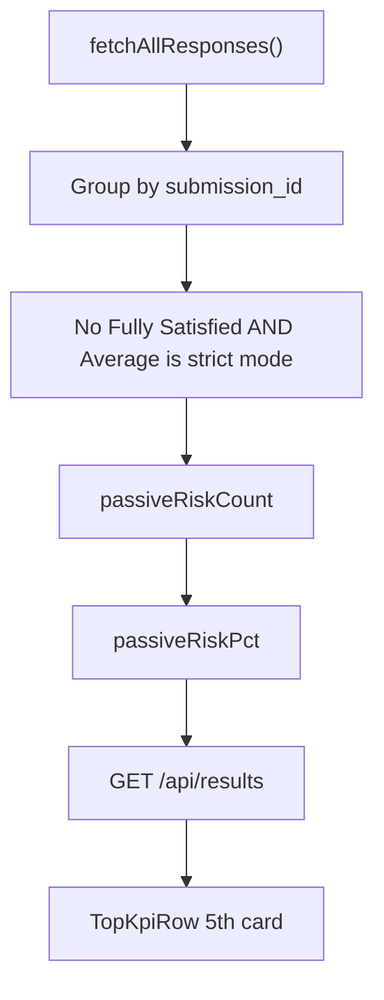

# Add Passive Risk Suppliers KPI + Dashboard UX fixes

## Current dashboard (after your removals)

[`app/dashboard/page.tsx`](app/dashboard/page.tsx) now renders:

```
ScoreLegend → TopKpiRow (4 cards) → HeroAnalyticsRow → PerformanceAnalysisRow (radar only)
→ ContributionAnalysisRow (Gap Analysis only) → RiskMitigationMatrix
```

**Removed / commented out:**

- [`SectionContributionChart`](components/dashboard/SectionContributionChart.tsx) — dropped from [`ContributionAnalysisRow`](components/dashboard/ContributionAnalysisRow.tsx)
- Performance insight cards (Top Performing / Priority Improvement) — dropped from [`PerformanceAnalysisRow`](components/dashboard/PerformanceAnalysisRow.tsx)
- [`StrategicRecommendation`](components/dashboard/StrategicRecommendation.tsx) — commented out on page

**UX problems this leaves:**

| Issue | Cause |
|---|---|
| Radar and Gap charts sit in half-width columns | Both still use `.analysis-row` (`1.5fr 1fr` grid) built for two-column layouts |
| Awkward empty grid slot | Single child in a 2-column grid |
| Dead code | Unused imports/vars in `PerformanceAnalysisRow`; stale `StrategicRecommendation` import on page |
| 5 KPI cards will cramp | `lg:grid-cols-5` on a 4-card row is too tight on laptop widths |
| Extra vertical gaps | `.hero-row` / `.analysis-row` add `margin-bottom: 2rem` on top of `.dash-stack` gap |

---

## Part A — Passive Risk KPI

### Definition (confirmed)

A supplier submission is **passively at risk** when, across all scored answers (q1–q31):

1. **Never** selected `"Fully Satisfied"`
2. **`"Average"` is the strict mode** — highest answer count, uniquely (ties disqualify)

**Percentage:** `passiveCount / totalSubmissions × 100` (respondents only).



### 1. Scoring helper — [`lib/scoring.ts`](lib/scoring.ts)

Add `computePassiveRisk(rows: AnswerRow[])` returning `{ count, pct }` (logic unchanged from prior plan).

### 2. API — [`app/api/results/route.ts`](app/api/results/route.ts)

Return `passiveRiskCount` and `passiveRiskPct` in JSON.

### 3. Types — [`lib/dashboard/types.ts`](lib/dashboard/types.ts)

```typescript
passiveRiskCount: number;
passiveRiskPct: number;
```

### 4. KPI card — [`components/dashboard/TopKpiRow.tsx`](components/dashboard/TopKpiRow.tsx)

| Field | Value |
|---|---|
| **label** | Passive Risk Suppliers |
| **value** | `{passiveRiskPct}%` |
| **subtext** | `{passiveRiskCount} of {total} respondents` |
| **pill** | `"Silent Dissatisfaction"` (amber if ≥20%, green otherwise) |

**Responsive grid** (avoid cramming 5 cards on laptop):

```tsx
className="grid grid-cols-2 gap-3 sm:grid-cols-3 xl:grid-cols-5"
```

---

## Part B — UX fixes for removed charts

### 5. Full-width single-chart layout — [`app/globals.css`](app/globals.css)

Add a dedicated class for lone chart sections (replaces misused `.analysis-row`):

```css
.chart-row-full {
  display: grid;
  grid-template-columns: 1fr;
  gap: 16px;
}
```

Remove `margin-bottom: 2rem` from `.hero-row` and `.analysis-row` — vertical rhythm handled by `.dash-stack { gap: 1.25rem }`.

Keep `.analysis-row` for any future true two-column pairs.

### 6. PerformanceAnalysisRow — [`components/dashboard/PerformanceAnalysisRow.tsx`](components/dashboard/PerformanceAnalysisRow.tsx)

- Wrap radar in `.chart-row-full` instead of `.analysis-row`
- Remove unused imports/vars: `getScoreColor`, `rankSections`, `best`, `worst`, `topRisk`
- Fix broken JSX (stray closing `</div>` from removed insight column)

### 7. ContributionAnalysisRow — [`components/dashboard/ContributionAnalysisRow.tsx`](components/dashboard/ContributionAnalysisRow.tsx)

- Use `.chart-row-full` wrapper
- Add [`SectionHeader`](components/dashboard/SectionHeader.tsx) title **"Satisfaction Gap Analysis"** above the chart for section hierarchy (replaces the removed contribution chart as a visual anchor)

### 8. Page cleanup — [`app/dashboard/page.tsx`](app/dashboard/page.tsx)

- Remove unused `StrategicRecommendation` import
- Delete commented-out JSX block

No `buildExecutiveSummary` change — Strategic Recommendation is removed; passive risk context lives in the KPI card subtext/pill only.

---

## Final dashboard flow

```
Header
ScoreLegend
TopKpiRow (5 cards — incl. Passive Risk Suppliers)
HeroAnalyticsRow (3-col — unchanged)
PerformanceAnalysisRow (full-width radar)
ContributionAnalysisRow (full-width gap analysis + section header)
RiskMitigationMatrix
Footer
```

## Unchanged

- No DB migration
- Existing 4 KPI card labels/logic
- HeroAnalyticsRow, RiskMitigationMatrix, GapAnalysisChart internals

## Verification

1. `GET /api/results` returns `passiveRiskCount` and `passiveRiskPct`
2. 5 KPI cards render without overlap on mobile (2-col) and desktop (5-col at xl)
3. Radar and Gap charts span full content width — no empty half-column
4. No unused imports / dead commented code on dashboard page
5. `npm run build` passes
